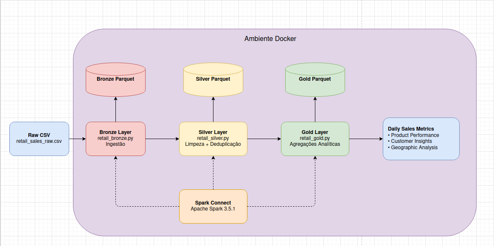

# PySpark ETL - Pipeline de Vendas Retail

Um pipeline ETL completo desenvolvido com PySpark e Spark Connect para processamento de dados de vendas em camadas (Bronze, Silver e Gold).



## 📋 Arquitetura do Projeto

O projeto segue o padrão **Medallion Architecture** (Medallion Lakehouse):

- **Bronze**: Camada de ingestão de dados brutos do arquivo CSV
- **Silver**: Camada de limpeza, deduplicação e transformação dos dados
- **Gold**: Camada de agregação e análise de dados consolidados

## 🛠️ Stack Tecnológico

- **Apache Spark**: 3.5.1 com Spark Connect
- **PySpark**: Para processamento distribuído de dados
- **Docker & Docker Compose**: Para containerização do Spark e MySQL
- **MySQL**: Banco de dados para persistência
- **Python**: 3.x

## 📦 Pré-requisitos

- Docker e Docker Compose instalados
- Python 3.x instalado
- pip para gerenciar dependências Python

## 🚀 Instruções de Execução

### 1. Clonar o Repositório

```bash
git clone <url-do-repositorio>
cd pyspark-etl
```

### 2. Criar um Arquivo `.env` (Opcional)

Se você quiser personalizar as credenciais do MySQL, crie um arquivo `.env` na raiz do projeto:

```env
MYSQL_ROOT_PASSWORD=rootpassword
MYSQL_DATABASE=retail_db
MYSQL_USER=retail_user
MYSQL_PASSWORD=retail_password
```

### 3. Iniciar os Containers Docker

Suba os serviços do Spark e MySQL:

```bash
docker-compose up -d
```

Verifique se os containers estão rodando:

```bash
docker ps
```

### 4. Criar e Ativar o Ambiente Virtual Python

```bash
python -m venv venv
source venv/bin/activate  # No Windows: venv\Scripts\activate
```

### 5. Instalar as Dependências Python

```bash
pip install -r requirements.txt
```

### 6. Gerar Dados Brutos (Opcional)

Se você quiser gerar dados de exemplo:

```bash
python generate_raw_data.py
```

Isso criará o arquivo `data/raw/retail_sales_raw.csv`.

### 7. Executar os Scripts ETL em Ordem

**Camada Bronze** - Ingestão dos dados brutos:

```bash
python retail_bronze.py
```

**Camada Silver** - Limpeza e transformação:

```bash
python retail_silver.py
```

**Camada Gold** - Agregação e análise:

```bash
python retail_gold.py
```

### 8. Validar os Dados (Opcional)

Abra o notebook Jupyter para análises exploratórias:

```bash
jupyter notebook validacao_camadas.ipynb
```

## 📁 Estrutura de Arquivos

```
pyspark-etl/
├── docker-compose.yml          # Configuração dos containers
├── requirements.txt             # Dependências Python
├── generate_raw_data.py         # Script para gerar dados de teste
├── retail_bronze.py             # ETL - Camada Bronze
├── retail_silver.py             # ETL - Camada Silver
├── retail_gold.py               # ETL - Camada Gold
├── validacao_camadas.ipynb      # Notebook para validação
├── readme.md                    # Este arquivo
└── data/
    └── raw/
        └── retail_sales_raw.csv # Dados brutos de vendas
```

## 🔌 Conexão com Spark Connect

Os scripts se conectam ao Spark via Spark Connect na porta `15002`:

```python
spark = SparkSession.builder \
    .remote("sc://localhost:15002") \
    .getOrCreate()
```

## 🗄️ Dados Armazenados

Os dados processados são salvos em formato Parquet:

- **Bronze**: `/opt/spark-data/bronze/retail_sales_bronze.parquet`
- **Silver**: `/opt/spark-data/silver/retail_sales_silver.parquet`
- **Gold**: `/opt/spark-data/gold/` (múltiplos DataFrames de análise)

## 📊 Camada Gold - Análises Disponíveis

A camada Gold gera as seguintes agregações:

1. **Daily Sales Metrics** - Métricas de vendas diárias
2. **Product Performance** - Desempenho por produto
3. **Customer Insights** - Análises por cliente
4. **Geographic Analysis** - Análises por localização

## 🛑 Parar os Containers

Para encerrar os serviços:

```bash
docker-compose down
```

Para remover também os volumes (dados MySQL):

```bash
docker-compose down -v
```

## ⚡ Dicas e Troubleshooting

### Porta 15002 já em uso

Se a porta 15002 está ocupada, modifique o `docker-compose.yml`:

```yaml
ports:
  - "15002:15002"  # Mude para "15003:15002" por exemplo
```

E atualize a URL de conexão no código:

```python
.remote("sc://localhost:15003")
```

### Erro de conexão com Spark

Verifique se o container do Spark está rodando:

```bash
docker logs spark-connect-server
```

### Liberar memória

Se tiver problemas de memória, limpe os dados antigos:

```bash
docker exec spark-connect-server rm -rf /opt/spark-data/
```

